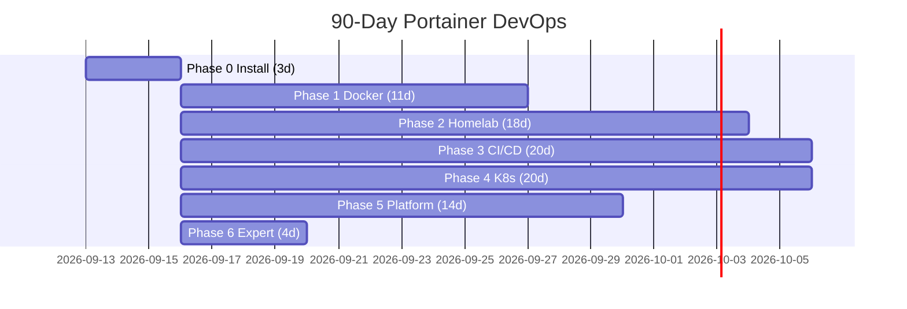

# DevOps 90-Day Tracker — Portainer-First (Approach A)

> Level: some basics | Host: Ubuntu 24.04 noble x86_64 | Goal: job + homelab + platform
> Method: GUI to learn → CLI to cement | Rule: everything in git, rebuild from git only, pin versions

**Progress:** update manually as you check boxes — `____ / 90 days`

**How to use this site:**

1. Work top-to-bottom, left nav = phases.
2. Check `- [x]` only when ✅ validation passes.
3. Checkboxes auto-save in this browser (localStorage via `assets/progress.js`).
4. Don't start Day N+1 if Day N fails.

## Roadmap at a glance

!!! note "Mermaid not rendering?"
    Enable `pymdownx.superfences` mermaid, or view Gantt as list below.

| Phase | Days | Outcome |
|-------|------|---------|
| [0 Install](phase-0-install.md) | 1-3 | Docker + Portainer `lts` on `https://<IP>:9443` |
| [1 Docker](phase-1-docker.md) | 4-14 | containers, volumes, networks, stacks |
| [2 Homelab](phase-2-homelab.md) | 15-32 | NPM/Traefik, WordPress, Uptime-Kuma, hardening |
| [3 CI/CD](phase-3-cicd.md) | 33-52 | git stacks, webhooks, Actions → GHCR, dev/prod |
| [4 K8s](phase-4-k8s.md) | 53-72 | k3s in Portainer, manifests, Helm, PVC/TLS |
| [5 Platform](phase-5-platform.md) | 73-86 | Terraform+Ansible, ArgoCD, LGTM, security, DR |
| [6 Expert](phase-6-expert.md) | 87-90 | Edge, chaos, portfolio, interview |

## Quick links

- Portainer CE source: [portainer/portainer](https://github.com/portainer/portainer)
- Install docs: `https://docs.portainer.io/start/install-ce/server/docker/linux`
- Local preview: `pip install mkdocs-material && mkdocs serve -a 0.0.0.0:8002`

## Done definition

- [ ] All ✅ checked, rebuild-from-git drills passed, portfolio public, rollback <5min, restore verified
